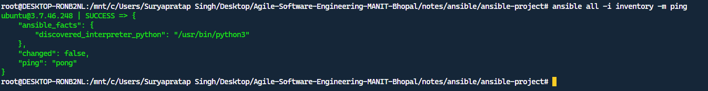
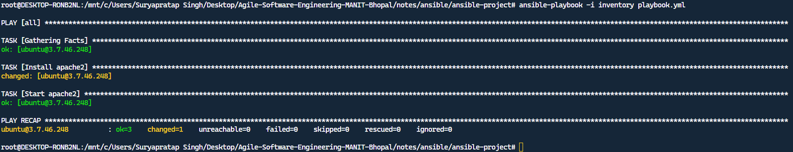
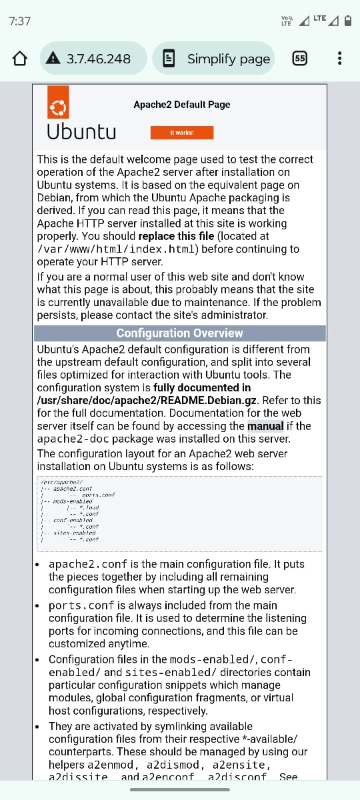

## Configure IaaS infrastructure using Ansible. 
- Install Ansible on your local machine.
```
sudo apt update
apt install pipx
pipx install --include-deps ansible
```
- Create a new directory for your project.
```
mkdir ansible-project
cd ansible-project
```
- Create an inventory file.
```
touch inventory
```
- Add the remote machine's IP address to the inventory file.
```
[all]
# OR
<public-ip>
```
- Create an SSH key pair.
```
ssh-keygen
# OR
ssh-keygen -t rsa -b 4096 -C "<your_email>"
```
- Copy the public key to the remote machine.
```
ssh-copy-id -i ~/.ssh/id_rsa.pub <username>@<public-ip>
```
- Verify the connection.
```
ansible all -i inventory -m ping
```

- Create a playbook file.
```
touch playbook.yml
```
- Write a playbook to install a package on the remote AWS machine.
```yaml
---
- hosts: all
  become: true
  tasks:
    - name: Install apache2
      apt:
        name: apache2
        state: present
    - name: Start apache2
      service:
        name: apache2
        state: started
```
- Run the playbook.
```
ansible-playbook -i inventory playbook.yml
```

- Verify the installation.
```
curl http://<public-ip>
# OR
http://<public-ip>
```


> Never try make access of this public IP, it's not available now, I've terminated the instance and deleted the key pair.
